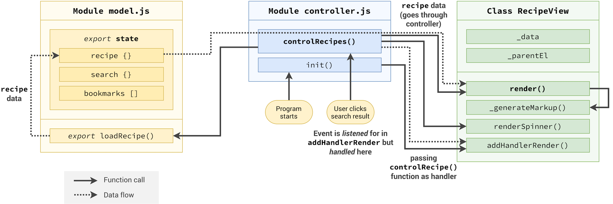

# forkifyApp

Forkify Application is all about searching for Recipe or Ingredients & displaying them on User Interface.

### User Stories

1. As a User, I want to **_search for recipes_**, so that I can find new ideas for meals.
2. As a User, I want to be able to **_update the number of servings_**, so that I can cook a meal for different number of people.
3. As a User, I want to **_bookmark recipes_**, so that I can review them later.
4. As a User, I want to be able to **_create my own recipes_**, so that I have them all organized in the same app.
5. As a User, I want to be able to **_see my bookmarks & own recipes when I have the app & come back later_**, so that I can close the app safely after cooking.

### Features

- **Search for recipes**
  - _Search functionality_: Input field to send request to _API_ with searched keywords.
  - Display results with _pagination_
  - Display _recipe_ with _Cooking Time_, _Servings_ & _Ingredients_.
- **Update the number of servings**
  - _Change servings functionality_: Update all ingredients according to current number of servings.
- **Bookmark recipes**
  - _Bookmark functionality_: display list of all bookmarked recipes.
- **Create my own recipes**
  - _User_ can upload own recipes.
  - _User_ recipes will automatically be bookmarked, so that the _User_ can easily find all of their recipes.
  - Each _user_ can only see their own recipes, not recipes from other _users_.
- **See my bookmarks & own recipes when I have the app & come back later**
  - Store bookmark data in the browser using _local storage_.
  - On page load, read saved bookmarks from _local storage_ & display.

## Project Planning (1)

- **Search Functionality: API search request.**
- **Results with pagination.**
- **Display Recipe.**

### FlowChart for Recipe Loading (Part 1)

### Architecture for Recipe Loading

## Project Planning (2)

- **Change servings functionality.**
- **Bookmarking Fnctionality.**
- **Store Bookmark data in the browser.**
- **On page load, read saved bookmarks.**

### FlowChart (Part 2)

## Project Planning (3)

- **Own Recipe upload.**
- **Own Recipe automatically bookmarked.**
- **User can only see own recipes, bot from others.**

### FlowChart (Part 3)

